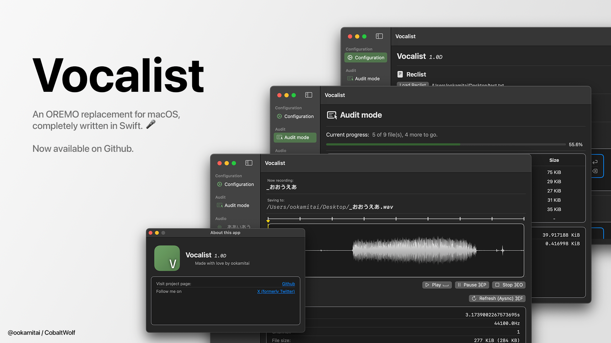
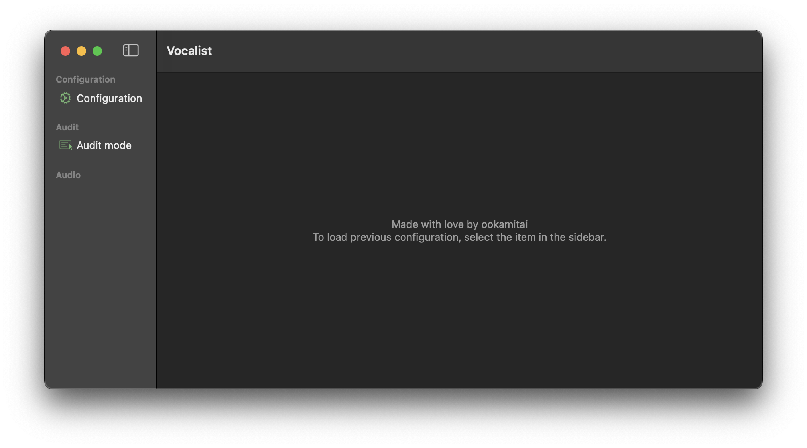
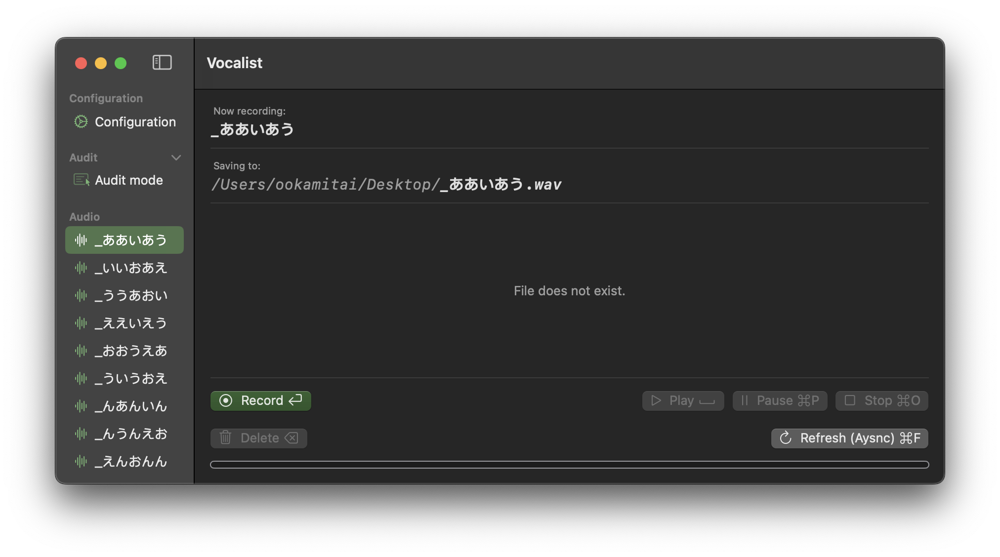
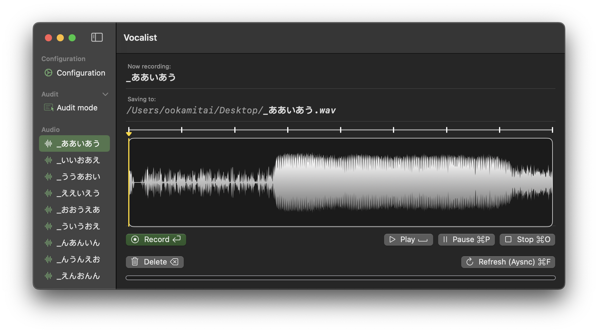
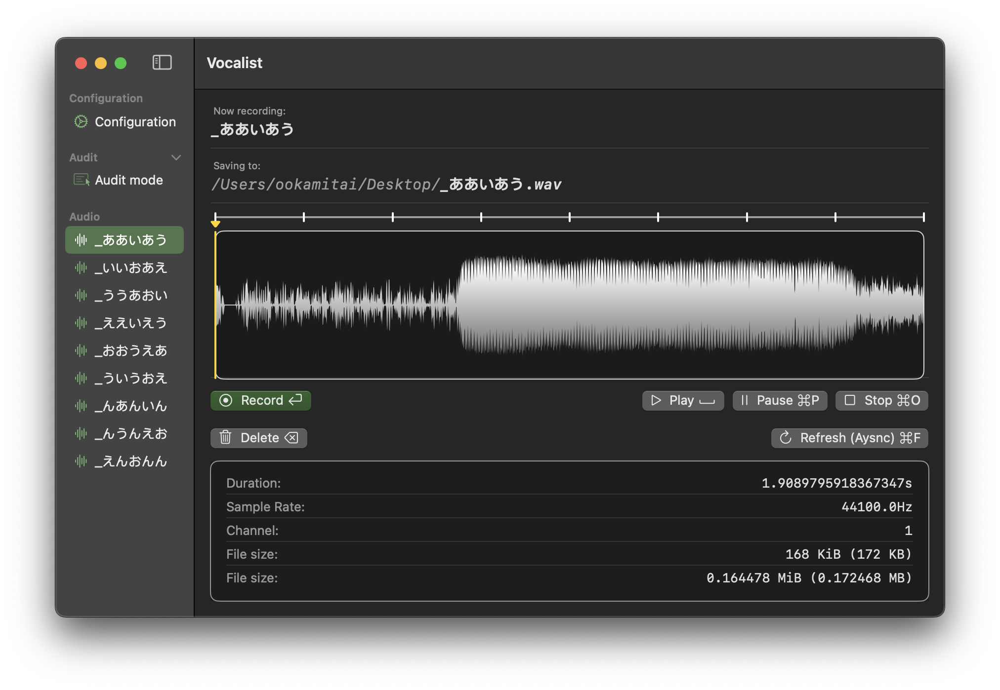
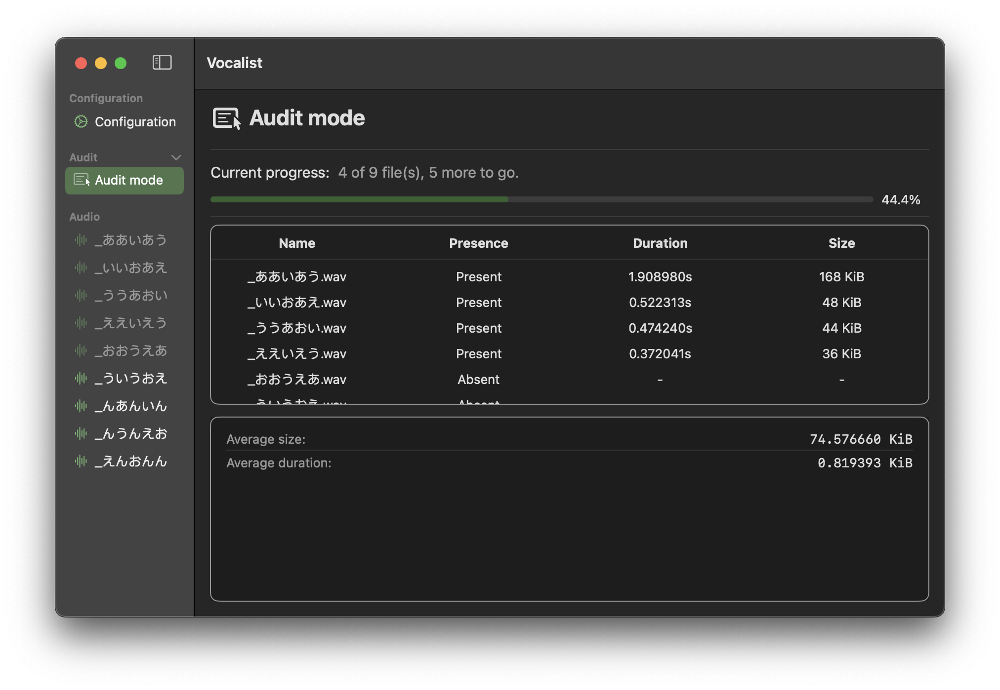
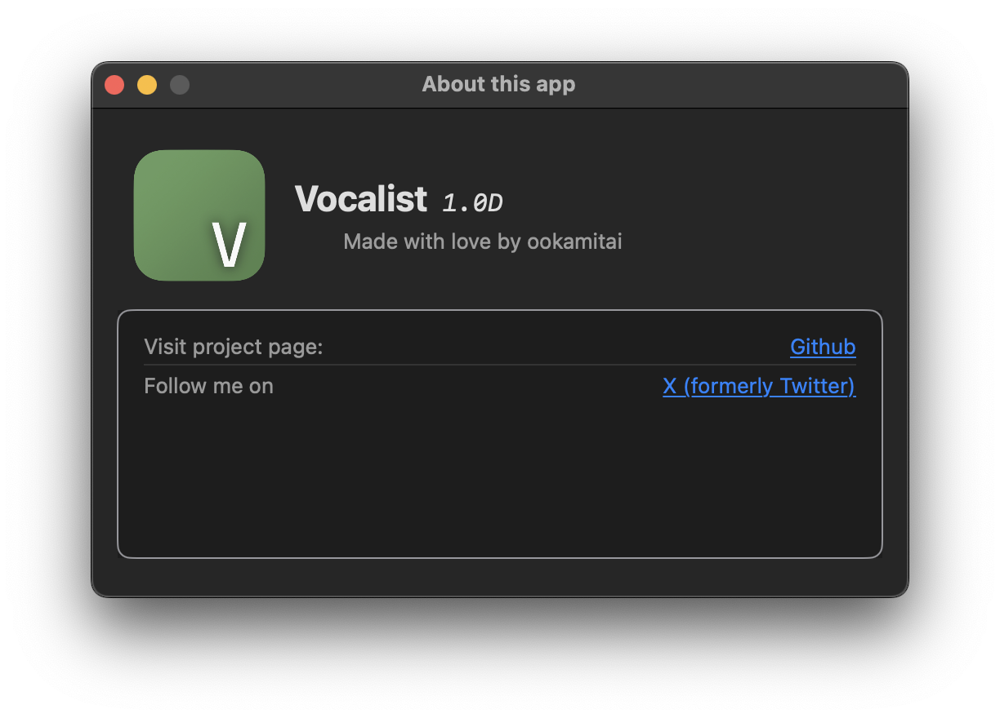

# Vocalist: An OREMO replacement for macOS, completely written in Swift

Follow me on my socials and like this repo!  

## Quick start
This project is under the `MUGA Project` (make UTAU great again).  

To use the program, download binaries from [here](https://github.com/ookamitai/Vocalist/releases/).

(Currently, Japanese translations are unavailable)

**Note: Screenshots are taken with version `1.0D`**

### First time open

- Once the program opens, you'll be greeted with the main window.

- Select the `Configuration` tab from the sidebar.

- This view panel is **scrollable**, scroll down for more options.

### Configure your recording environment

- Click the `Load Reclist` button, this will bring up a `File Importer` window, and select the reclist you are going to use.

- **Vocalist loads the file in Shift-JIS encoding by default, you can choose to load in UTF-8 by clicking the `Use UTF-8?` checkbox.**

- Click the `Load Folder` button, and select the folder you want to save your recordings to.

### Configure extra options

- `Fast mode`

Enabling this option will change the shortcut key for `Record` from `Return` to the `Right arrow key`, and change the shortcut key for `Delete` from `Delete` to the `Left arrow key`.

- Hide recorded items

Enabling this option will hide the recorded item from the sidebar. ~~(Little glitchy)~~

- Remove UserDefaults

This will remove all configurations saved by Vocalist.

### Record your voice

After you have configured your environment, select an entry from the `Audio` section in the sidebar.

Press the `Record` button, or the shortcut key (next to the text), to record your voice. And press again to stop recording.

After you have recorded, more buttons become available.  

- `Play (Space)`: Play the audio.
- `Pause (cmd+P)`: Pause the audio.
- `Stop (cmd+O)`: Stop playing the audio.
- `Delete (Delete/Space)`: Delete the recording.
- `Refresh (Async) (cmd+F)`: Refresh the audio data.

You can also resize the window to see the extra information for the audio.

### Using `Audit mode` to see your progress

After you have done some recording, you can switch to `Audit mode` by selecting the `Audit mode` tab in the sidebar.

**Note: There's a typo in `Average duration: ... KiB`. This has been fixed in `1.0.1E`**

Here you can see how many recordings are done, how much progress you have made, and some general file info.

### About this app

Select `Vocalist` - `About this app` will bring up the `About` window.

### Reusing the previous configuration

It's possible to reuse the previous configuration because Vocalist saves it automatically.

Vocalist reloads the previous configuration if there's one when selecting the `Configuration` tab.

## Todo
- **Finished** ~~Add `AuditView` for viewing all your audio files at once~~
- **Finished** ~~Fix `Recording` bug~~
- Add spectrogram
- Add live recording waveform display
- May integrate into `Playwright`, but this will only happen when `Playwright` is partially complete.